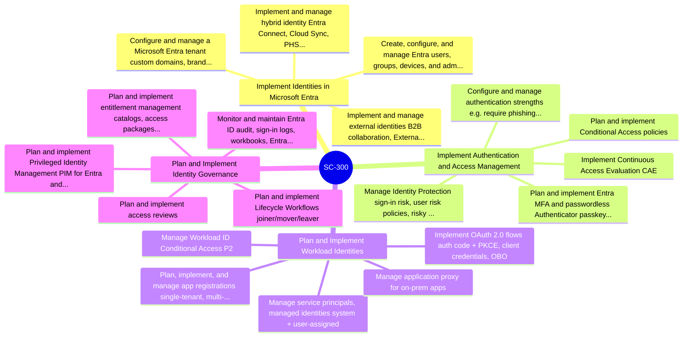
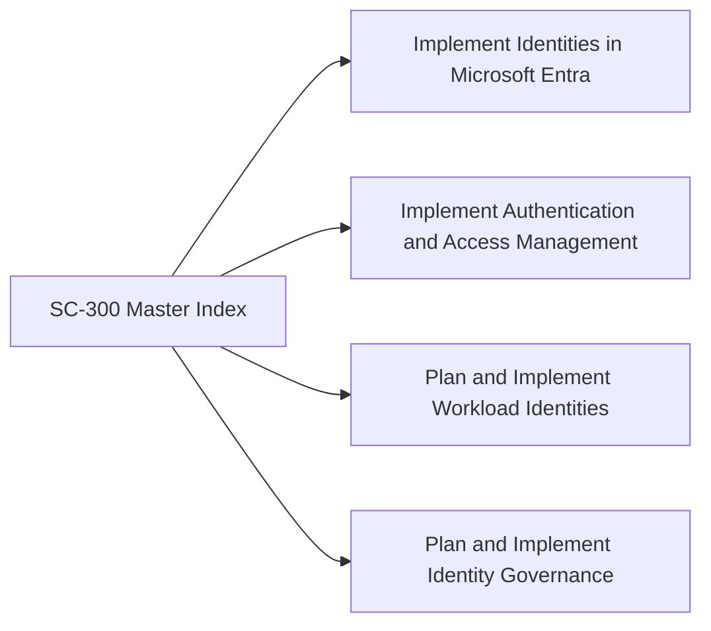
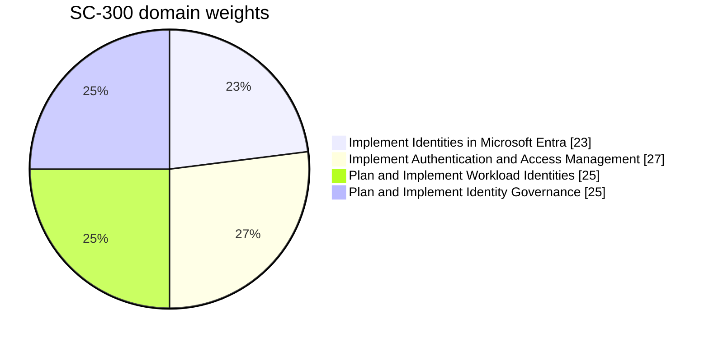

# SC-300 - Microsoft Identity and Access Administrator - Visual Study Guide

> Concept-only study aid. No exam questions reproduced. Source PDF (if any) stays local + gitignored.

**Skills outline:** https://learn.microsoft.com/en-us/credentials/certifications/exams/sc-300/

## Master mind map

## Domain map

## Domain weights

> Click a slice / legend label to jump to that chapter.

## Recommended study order

```mermaid
gantt
    title Suggested study plan
    dateFormat X
    axisFormat Day %d
    section Plan
    Implement Identities in Microsoft Entra :t1, 0, 2d
    Implement Authentication and Access Management :t2, after t1, 2d
    Plan and Implement Workload Identities :t3, after t2, 2d
    Plan and Implement Identity Governance :t4, after t3, 2d
```

---

**Next:** open [01-entra-identities.md](01-entra-identities.md)

<!-- TODO: fill remaining sections via Copilot chat. Target structure mirrors c:\az305\study-guide\00-MASTER-INDEX.md. -->
