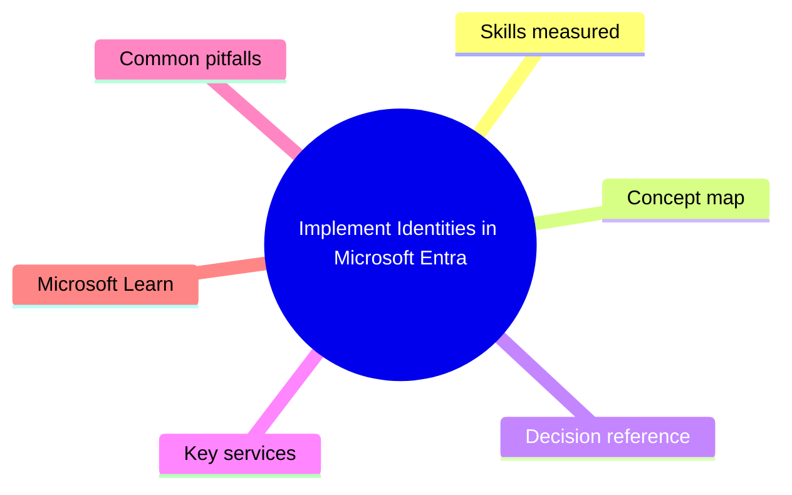
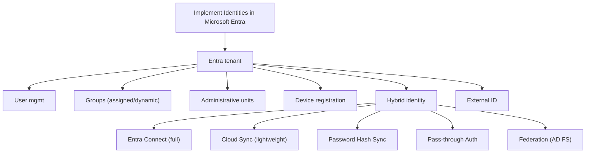

# Implement Identities in Microsoft Entra

> Domain 1 of SC-300. Weight: 23%.

## Domain mind map

## Skills measured

- Configure and manage a Microsoft Entra tenant (custom domains, branding, properties)
- Create, configure, and manage Entra users, groups, devices, and administrative units
- Implement and manage external identities (B2B collaboration, External ID for customers)
- Implement and manage hybrid identity (Entra Connect, Cloud Sync, PHS, PTA, Federation)

## Concept map

## Decision reference

| When you see... | Pick... | Why |
|---|---|---|
| On-prem multi-forest sync | Entra Connect (still required for some scenarios) | Cloud Sync supports multi-forest now but with limits |
| Lightweight sync, agent-only | Entra Cloud Sync | No SQL, faster setup |
| Need on-prem MFA at sign-in | Federation (AD FS) or PTA + cloud MFA | PHS does not invoke on-prem MFA |
| Delegate IT to a region without giving global rights | Administrative unit + scoped role | Scoped to an AU |
| Customer-facing IDP for new app | Microsoft Entra External ID for customers | Replaces Azure AD B2C |
| Partner needs access to one app | B2B guest invite + entitlement mgmt access package | Time-bound + access reviews |

## Key services

- **Entra ID P1/P2** - Required for CA, Identity Protection, PIM, governance
- **Entra Connect / Cloud Sync** - Hybrid sync engines
- **Entra External ID** - B2B + B2C scenarios
- **Administrative Units** - Scoped admin model
- **Dynamic groups** - Membership rules - require P1

## Common pitfalls

- Using Cloud Sync where Entra Connect features are still required (e.g. device write-back, password write-back limits)
- Forgetting AUs do not propagate Conditional Access scope (only role scope)
- Inviting B2B guests to a global group instead of an entitlement package
- Configuring federation for SSO where PHS would suffice

## Microsoft Learn

- [Implement an identity management solution](https://learn.microsoft.com/training/paths/implement-identity-management-solution/)
- [Entra Cloud Sync vs Connect](https://learn.microsoft.com/entra/identity/hybrid/cloud-sync/what-is-cloud-sync)

---

[<- Master Index](00-MASTER-INDEX.md) | [Master Index](00-MASTER-INDEX.md) | [Implement Authentication and Access Management ->](02-authentication-access.md)
