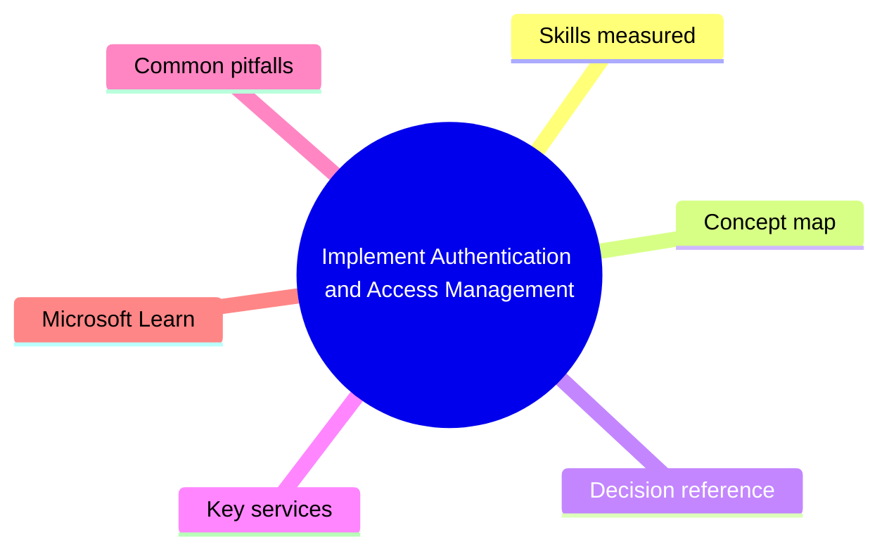
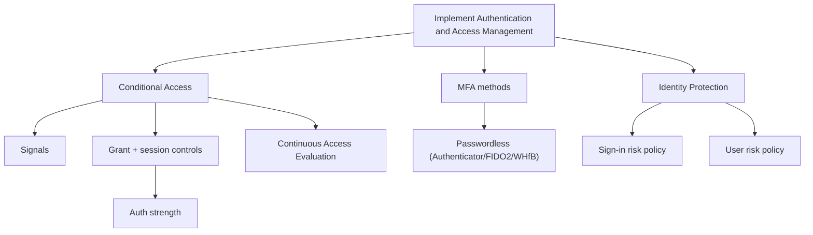

# Implement Authentication and Access Management

> Domain 2 of SC-300. Weight: 27%.

## Domain mind map

## Skills measured

- Plan and implement Conditional Access policies
- Plan and implement Entra MFA and passwordless (Authenticator passkeys, FIDO2, Windows Hello for Business)
- Configure and manage authentication strengths (e.g. require phishing-resistant)
- Manage Identity Protection (sign-in risk, user risk policies, risky users)
- Implement Continuous Access Evaluation (CAE)

## Concept map

## Decision reference

| When you see... | Pick... | Why |
|---|---|---|
| Require phishing-resistant MFA for admins | Authentication strength = phishing-resistant + CA targeting role assignments | Built-in strength includes WHfB, FIDO2, cert-based |
| Block legacy auth | CA policy targeting 'Other clients' (legacy) - block | Single most impactful CA policy |
| Step-up auth on high-risk sign-in | Identity Protection sign-in risk policy - require MFA | Risk-based MFA |
| Force re-evaluation when token revoked | CAE - enabled by default for supporting clients | Near-real-time enforcement |
| Roll out passwordless to org | Authenticator passkeys + Temporary Access Pass for onboarding | TAP bridges first-time setup |

## Key services

- **Conditional Access** - Policy engine (signals -> decision -> controls)
- **Authentication strengths** - Predefined or custom MFA combinations
- **Identity Protection (P2)** - Risk detections + automated remediation
- **Continuous Access Evaluation** - Token revocation pushed to RPs
- **Passkeys in Authenticator** - FIDO2 device-bound keys

## Common pitfalls

- Forgetting break-glass accounts excluded from CA (lockout risk)
- Mixing 'Require MFA' with 'Require Authentication Strength' (the latter is more specific)
- Confusing user risk vs sign-in risk (user = compromised credentials; sign-in = anomalous behavior)
- Using report-only forever - eventually enable

## Microsoft Learn

- [Implement an authentication and access management solution](https://learn.microsoft.com/training/paths/implement-authentication-access-management/)
- [CAE](https://learn.microsoft.com/entra/identity/conditional-access/concept-continuous-access-evaluation)
- [Authentication strengths](https://learn.microsoft.com/entra/identity/authentication/concept-authentication-strengths)

---

[<- Implement Identities in Microsoft Entra](01-entra-identities.md) | [Master Index](00-MASTER-INDEX.md) | [Plan and Implement Workload Identities ->](03-workload-identities.md)
