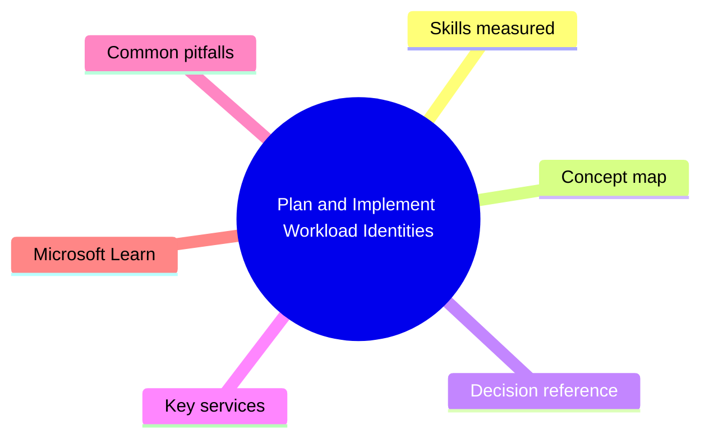
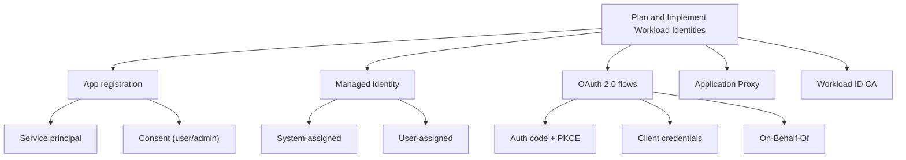

# Plan and Implement Workload Identities

> Domain 3 of SC-300. Weight: 25%.

## Domain mind map

## Skills measured

- Plan, implement, and manage app registrations (single-tenant, multi-tenant)
- Manage service principals, managed identities (system + user-assigned)
- Implement OAuth 2.0 flows (auth code + PKCE, client credentials, OBO)
- Manage application proxy for on-prem apps
- Manage Workload ID Conditional Access (P2)
- Manage permissions, consent (admin / user), publisher verification

## Concept map

## Decision reference

| When you see... | Pick... | Why |
|---|---|---|
| Azure VM accesses Key Vault | System-assigned managed identity + RBAC role on KV | No secrets to manage |
| Multiple resources need same identity | User-assigned managed identity | Standalone, reusable |
| Public SPA app calling MS Graph | Auth code with PKCE | Secret-less browser flow |
| Daemon job calling MS Graph | Client credentials with cert (preferred over secret) | App-only token |
| API calls downstream API as the user | On-Behalf-Of (OBO) flow | Token exchange |
| Bring on-prem app to cloud SSO | Microsoft Entra Application Proxy | No VPN; KCD or HTTP header |
| Restrict service principal access to certain locations | Workload Identities P2 + CA on workload ID | Same CA engine for SPs |

## Key services

- **App registration** - Defines the app + permissions + redirect URIs
- **Service principal** - Per-tenant runtime instance of the app
- **Managed identity** - Azure-managed SP - no secret rotation
- **Workload Identities P2** - Conditional Access + Identity Protection for SPs
- **Application Proxy** - Reverse proxy for on-prem web apps

## Common pitfalls

- Confusing app registration (the app definition, in your tenant) with service principal (the runtime instance, possibly per-tenant)
- Storing client secrets when managed identity or certificate would work
- Granting admin consent for permissions users could consent to themselves
- Forgetting OBO requires API to have 'access_as_user' scope for downstream API

## Microsoft Learn

- [Implement workload identities solution](https://learn.microsoft.com/training/paths/implement-access-management-apps/)
- [Microsoft identity platform OAuth flows](https://learn.microsoft.com/entra/identity-platform/v2-oauth2-auth-code-flow)
- [Managed identities overview](https://learn.microsoft.com/entra/identity/managed-identities-azure-resources/overview)

---

[<- Implement Authentication and Access Management](02-authentication-access.md) | [Master Index](00-MASTER-INDEX.md) | [Plan and Implement Identity Governance ->](04-identity-governance.md)
