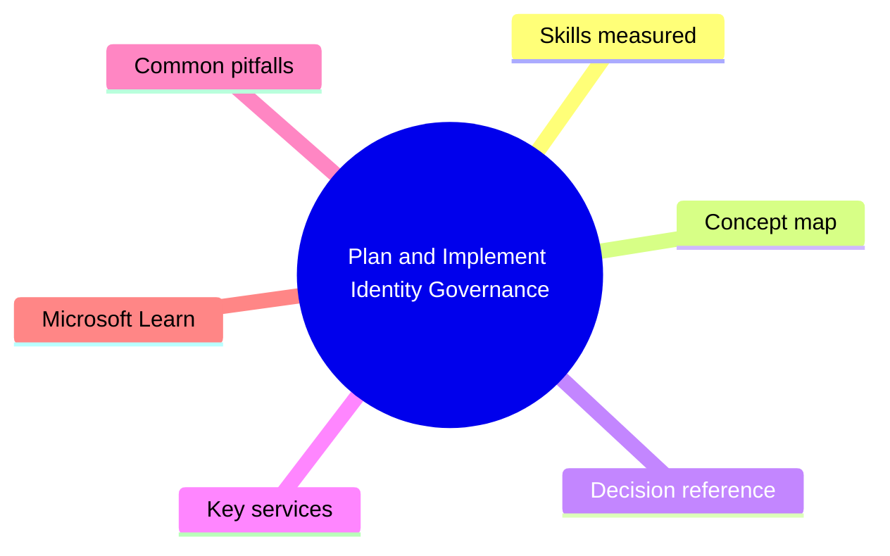
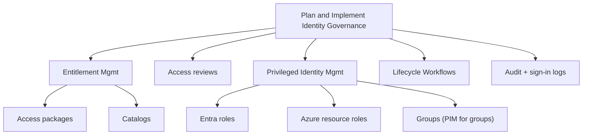

# Plan and Implement Identity Governance

> Domain 4 of SC-300. Weight: 25%.

## Domain mind map

## Skills measured

- Plan and implement entitlement management (catalogs, access packages, lifecycle)
- Plan and implement access reviews
- Plan and implement Privileged Identity Management (PIM) for Entra and Azure roles
- Monitor and maintain Entra ID (audit, sign-in logs, workbooks, Entra ID Identity Protection)
- Plan and implement Lifecycle Workflows (joiner/mover/leaver)

## Concept map

## Decision reference

| When you see... | Pick... | Why |
|---|---|---|
| Self-service request for access bundle | Entitlement mgmt access package + approval workflow | Lifecycle + re-review |
| Recertify privileged roles quarterly | Access reviews on PIM-eligible role assignments | Auto-revoke unused |
| Just-in-time admin | PIM eligible assignment + activation requirements (MFA, justification, approval) | Reduces standing privilege |
| Joiner/mover/leaver automation | Lifecycle Workflows with HR-driven attribute change | Native or via custom triggers |
| Audit who accessed an app last 90 days | Entra sign-in logs + Workbooks | Free 30-day; ingest to Sentinel for longer |

## Key services

- **Entra ID Governance (P2)** - Umbrella for EM, AR, PIM, LW
- **Entitlement Management** - Catalog + access package + lifecycle
- **Access Reviews** - Time-bounded review campaigns
- **PIM** - JIT activation for Entra + Azure roles + groups
- **Lifecycle Workflows** - JML automation

## Common pitfalls

- Using PIM for all roles - overhead. Use eligible only for privileged.
- Approving access reviews wholesale instead of per-user (defeats purpose)
- Assigning roles to users instead of role-assignable groups (manageability)
- Skipping the requestor settings on an access package (anyone-can-request risk)

## Microsoft Learn

- [Plan and implement an identity governance strategy](https://learn.microsoft.com/training/paths/plan-implement-identity-governance-strategy/)
- [Entra ID Governance](https://learn.microsoft.com/entra/id-governance/)

---

[<- Plan and Implement Workload Identities](03-workload-identities.md) | [Master Index](00-MASTER-INDEX.md) | [Cheatsheet ->](05-exam-cheatsheet.md)
