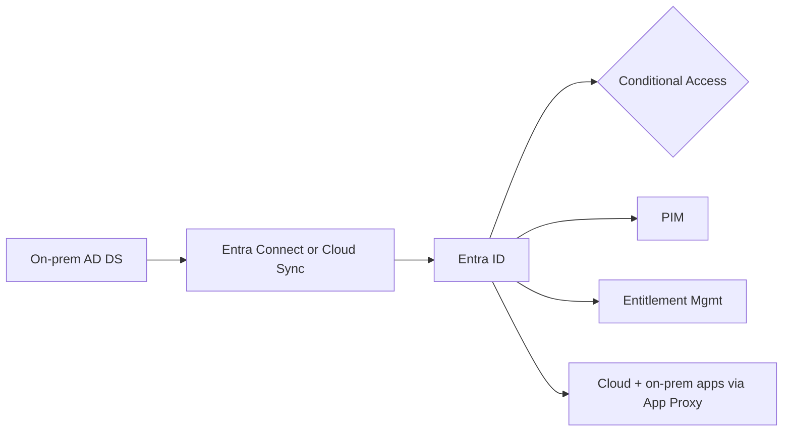
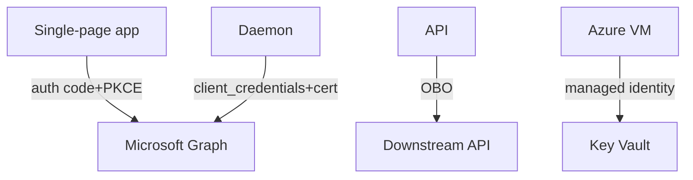

# Architectures - SC-300

> Reference architectures you should be able to draw on a whiteboard for the exam.

## Hybrid identity end-to-end

## Workload identity flows

---

[Master Index](00-MASTER-INDEX.md)
